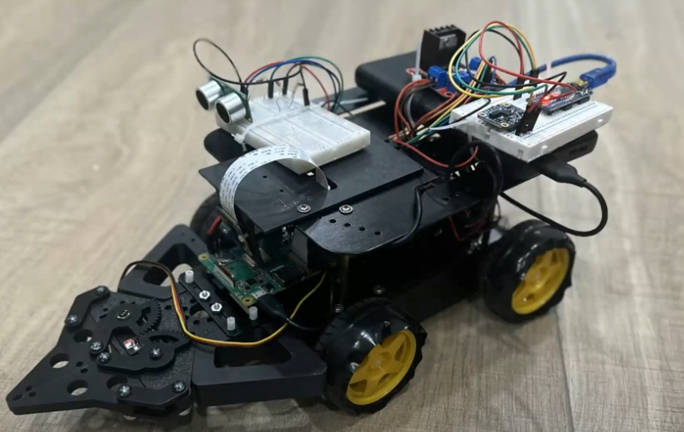

# Autonomous Robot Pick and Place

> Final project for **ENPM701: Autonomous Robots** at the University of Maryland.

This repository contains the libraries and scripts used for a robot tasked with autonomously navigating a randomized environment, detecting 9 different colored blocks, picking them up, transporting them, and placing them in a designated delivery zone.

---

## Project Overview

The system is designed around modular components split into three main categories:

- **Localization**: Robot position tracking and environment awareness  
- **Locomotion**: Movement and grasping
- **Perception**: Object and color detection

All components are integrated and executed through the `grandchallenge.py` script.

📄 See detailed project requirements in [`finalproject.pdf`](finalproject.pdf)

🎥 Watch my project walkthrough on YouTube: [**My Journey Through ENPM701**](https://www.youtube.com/watch?v=oqaQbwsCXi0)

